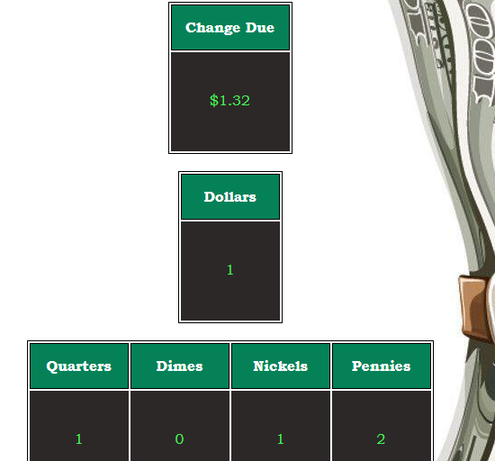

## WEB101 - Change Calculator

This project gave me a good introduction to performing logic in JavaScript, and the ease with which bugs can be introduced into the code. When the logic seemed to be working, there were some edge cases where the output was incorrect, such as giving 5 pennies in change instead of just 1 nickel. This was also a great opportunity to experiment with refactoring my code to make it concise and readable.

### App Screenshot

